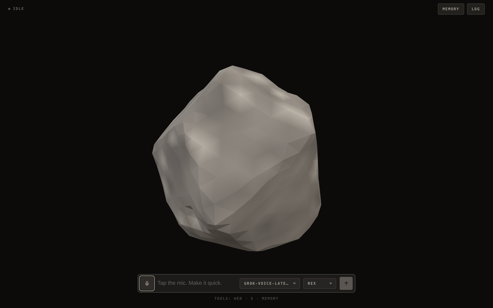
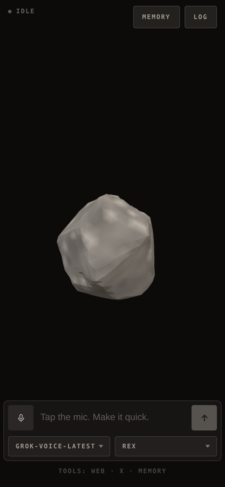

# Rock

A voice agent rendered as a boulder — several tons of granite that is not
impressed by your question and answers it correctly anyway. It runs on an xAI
Grok speech-to-speech session, and its squash, stomp and sway are driven by the
live audio, so it moves with whichever of you is talking.

It can search the web and X, and call remote MCP servers. It also remembers
what you tell it to, between calls, and — if you switch a connector on — hands
real work to an agent CLI running on your machine and tells you when it lands.



<p align="center">
  
</p>

## Run

```sh
npm install
cp .env.example .env      # add your XAI_API_KEY
npm run dev               # → http://localhost:5173
```

Click the mic, allow the browser's microphone prompt, and start talking. Talk
over him and he stops — and stomps.

Tapping the mic is the microphone switch: turning it off stops what you send and
leaves the answer playing, and the conversation is still there when you turn it
back on. It also switches itself off after a minute of silence, and the call
survives that too. Holding the mic down is the hang-up — a ring closes around it
while you hold, and the call ends when it lands.

`connectors` is where you point him at an agent. Switch **OpenClaw** on, give it
the repo to work in, and say what you want done: he writes the task up, reads it
back, and hands it over on a yes. It runs while the call carries on, and he says
so when it settles. Nothing is on until you switch it on — it edits real files —
and the panel is also where the work shows up, with a `stop` on anything still
running. See [connectors](docs/connectors.md).

`tools` has a switch for each tool he can reach for — web search, X search, and
any MCP server the environment gave him. Switching one off takes it out of the
call already in progress, and it stays off in that browser until you switch it
back on. Nothing there can add a tool the server was not started with.

The log keeps every conversation. `continue` on one picks it back up: the call is
dialled again with those turns handed over as context, and what you say from
there lands in the same entry rather than a new one.

| Script | |
|---|---|
| `npm run dev` | Vite, with the proxy mounted as middleware — one process |
| `npm run dev:lan` | The same, over HTTPS on the network — for a phone |
| `npm run build` | Bundles the client to `dist/` |
| `npm start` | Serves `dist/` with the same proxy in front |
| `npm run preview` | `build` then `start` |
| `npm run preview:lan` | `build` then `start`, over HTTPS on the network |
| `npm test` | `node:test`, against a stub xAI socket |
| `npm run lint` | ESLint |

CI runs the lint, the tests on Node 22.12 and 24, and a build that then has to
boot and serve itself over both HTTP and HTTPS. CodeQL scans the same source on
every push and again weekly, since its queries change faster than this does.

To run it on a phone, or in Docker, see
[configuration](docs/configuration.md#on-a-phone).

## Docs

- [**Configuration**](docs/configuration.md) — every environment variable, the
  HTTPS setup a phone needs for microphone access, Docker, and the tools.
- [**Connectors**](docs/connectors.md) — the OpenClaw agent he can hand work to:
  how it is run, what the panel may change, and who is allowed to ask.
- [**Design notes**](docs/design.md) — how the call is wired, the audio path,
  what's in `localStorage`, the moods, the source layout, and the seam another
  provider would have to implement.
- [**AI Output Disclaimer**](docs/ai-output-disclaimer.md) — what the model says
  is the model's, not the author's, plus the risks that are specific to a live
  microphone and speech you hear before anyone can check it.
- [**Not a Companion**](docs/not-a-companion.md) — Rock is a toy and a demo.
  It is not a friend, a therapist, or a partner, and the project will not grow in
  that direction.
